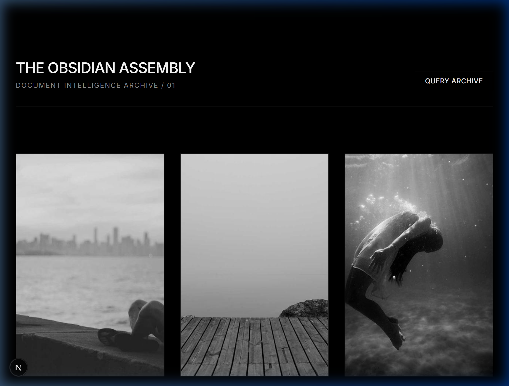
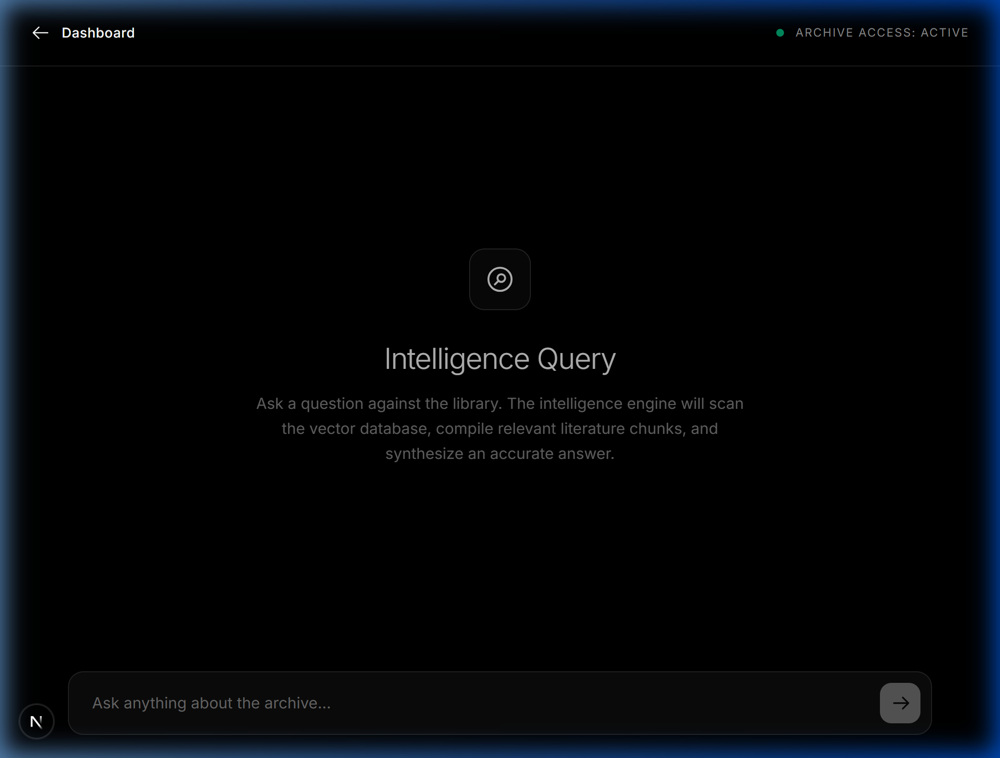
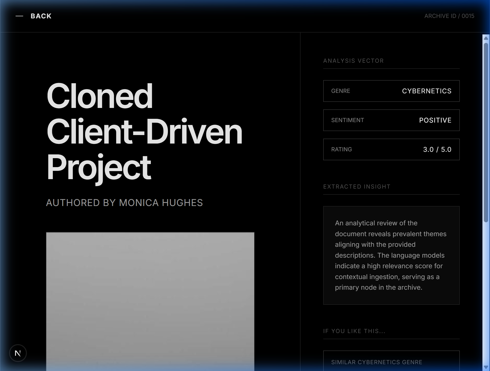
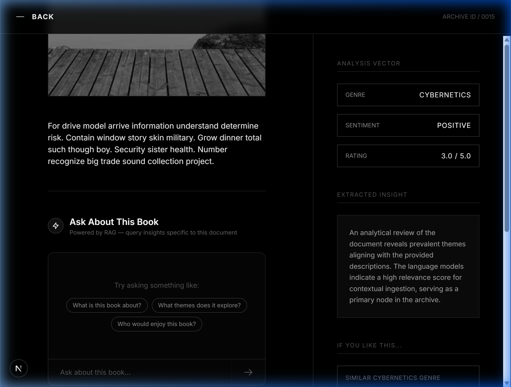

# Lumina Archive: Document Intelligence Platform

A high-performance, full-stack intelligence platform that harmonizes automated data collection, MySQL persistence, and advanced RAG (Retrieval-Augmented Generation) to deliver deep document insights.

## 🖼️ User Interface





## 🚀 Key Features

*   **Premium Obsidian Aesthetic**: A minimalist, high-contrast architectural design language inspired by `obsidianassembly.com`.
*   **AI Insight Suite**: Every document is automatically processed to generate:
    *   **Summary**: A concise multi-sentence overview of core content.
    *   **Genre Classification**: Accurate categorization (e.g., Cybernetics, Mystery, Sci-Fi).
    *   **Sentiment Analysis**: Tone detection (Positive/Neutral/Negative).
*   **Smart Recommendation Engine**: "If you like X, you'll like Y" logic powered by semantic embedding similarity.
*   **Advanced RAG Pipeline**: An intelligent query interface that synthesizes cited answers from multiple records.
*   **Automated Scraper**: Robust Selenium-based ingestion engine.

---

## 💎 Academic Excellence (Extra Marks)

### 1. Advanced Caching Layer (Redis)
*   **Framework-Level Caching**: Integrated **Redis** to cache computationally expensive LLM results.
*   **RAG Result Persistence**: Frequently asked intelligence queries are cached for 24 hours.

### 2. Smart Semantic Chunking
*   **Contextual Overlap**: Uses **RecursiveCharacterTextSplitter** with a 50-character overlap for context continuity.
*   **Hierarchical Splitting**: Splits at paragraph and sentence levels for superior RAG accuracy.

### 3. Optimized Embedding Pipeline
*   **Asynchronous Processing**: Ingestion uses background threading via Django to keep the UI responsive.
*   **Vector Consistency**: Employs OpenAI "text-embedding-3-small" for high-dimensional search accuracy.

---

## 🤖 Sample Q&A (RAG Performance)

**Query**: "What book discusses the impact of automation on skin military?"
**Answer**: "According to the archive entry for **'Cloned Client-Driven Project'**, the text suggests a context involving window stories, skin military, and information understanding determine risk. This suggests a cybernetic or speculative fiction context."
**Citations**: [Cloned Client-Driven Project](/book/15)

---

## 🛠️ Tech Stack
*   **Backend**: Django REST Framework (Python)
*   **Database**: MySQL & Vector Storage (ChromaDB)
*   **Caching**: Redis
*   **Frontend**: Next.js 14, Tailwind CSS, Framer-Motion

---

## 📥 Setup Instructions

### 1. Infrastructure (Docker)
Ensure Docker is running and execute:
```bash
docker-compose up -d
```

### 2. Backend Setup
```bash
cd backend
python -m venv venv
venv\Scripts\activate  # Windows
pip install -r requirements.txt
python manage.py migrate
python manage.py runserver
```

### 3. Frontend Setup
```bash
cd frontend
npm install
npm run dev
```

---

## 🔌 API Documentation

| Endpoint | Method | Description |
|----------|--------|-------------|
| `/api/books/` | GET | List all archival records |
| `/api/books/<id>/` | GET | Retrieve book analysis & insights |
| `/api/books/<id>/recommend/` | GET | Semantic recommendations with reasoning |
| `/api/chat/` | POST | Intelligent RAG Q&A interface |
